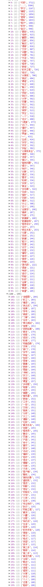

# 简介

基于 [Node.JS](https://nodejs.org/zh-cn/) 爬取 [博客园](https://www.cnblogs.com/) 1W+博文，对博文内容做关键词提取，生成词云。

# 演示

# 安装

安装 [git](https://git-scm.com/)、[Node.JS](https://nodejs.org/zh-cn/)、[MongoDB](https://docs.mongodb.com/)、[Yarn](http://yarnpkg.com/zh-Hans/docs)

克隆代码

    git clone git@github.com:ZhihaoJian/bokeyuan_spider.git

如果觉得安装速度慢，可将源切换到淘宝，`cmd` 或者 `powershell` 下执行

     yarn config set registry 'https://registry.npm.taobao.org'

进入`bokeyuan_spider`文件夹安装依赖 

    yarn install

# 目录结构

整个项目重要目录是`public`和`server`，`public`目录放置词云的前端代码，`server`目录放置后端代码。在项目中，`server`目录还放置了爬虫、数据库等相关代码。另外，根目录下的 `word.txt` 是 `jieba` 分词结果。

# 基本工作原理

我们知道互联网是通过每一份HTML通过某种方式互相关联在一起，从而形成一个巨大的 `网`。我们只要在其中一份页面就可以沿着 `网` 去到不同的页面。而页面和页面之间是通过 `超链接` 方式联系在一起，所以我们只要找到这个 `超链接` 就可以到达下一个页面。而爬虫就是这样的工作方式，找到 `超链接`，沿着超链接一直前进并记录下所到之处，就可以抵达互联网的任何一个角落。

# 核心功能

* 抓取博文链接

在 `spider.js` 中我们将使用 Google Chrome 的 `puppeteer`，作为演示

打开`server`目录下的`spider`文件里的`spider.js`。`spider.js`的主要功能是使用 [puppeteer](https://github.com/GoogleChrome/puppeteer) 对博客园的 [班级列表博文](https://edu.cnblogs.com/posts?filter=quality) 链接进行爬取。

以下是`spider.js`的核心代码

    /**
     *  spider.js
     */
    toPage(page, URL).then(async (url) => {
        console.log('PAGE LOG'.blue + ' Page has been loaded');

        //分页数量
        totalPages = await page.$eval('.last', el => Number.parseInt(el.textContent));
        console.log(`PAGE LOG`.blue + ` site:${URL} has ${totalPages} pages`);

        //抓取post文超链接
        for (let i = 1; i <= totalPages; i++) {
            url = getNextUrl(i);
            await toPage(page, url, 1500);
            let links = await parseElementHandle(page, url);
            let result = await getPostUrls(links);
            postUrls.push(result);
        }

        //保存到数据库
        saveToDB(postUrls);

        console.log('PAGE LOG : All tasks have been finished.'.green);
        writeToFileSys();
        await broswer.close();
    });

`toPage`方法是根据指定的URL跳转的相应页面，方法接收两个参数，`page`是经过 `puppeteer` 实例化的对象，`URL` 是我们指定爬虫的入口。待页面加载成功以后，响应回调函数，获取当前页面的最大分页数量，`for` 循环每隔 `1500ms` 跳转到下一页并抓取页面中所有博文链接。最后保存到数据库中。

* 抓取博文内容

打开 `content.js`，在这里我们不用前面演示的 `puppeteer` 模块而使用 `cheerio` 和 `request`模块。

安装 [cheerio](https://github.com/cheeriojs/cheerio) 和 [request](https://github.com/request/request) 模块

    yarn add cheerio request

`cheerio`可以简单看作是服务器端的jQuery，而`request`是一个高度封装好了的 `nodejs` http模块

以下是 `content.js` 的核心代码示例

        /* content.js
         * 根据post文链接抓取post文内容
         */
        getIPs().then(async ipTable => {
            for (let i = 0; i < postLen; i++) {
                let postUrl = docs[i];
                proxyIndex < ipTable.length ? proxyIndex : proxyIndex = 0;
                rq(postUrl, ipTable[proxyIndex++], (body) => parseBody(body, postUrl))
                    .catch(async e => {
                        console.log('LOG'.red + ': Request ' + postUrl + ' failed. Retrying...');
                        ipTable.splice(proxyIndex, 1);
                        await delay(3000);
                        getIPs().then(ips => ipTable = ipTable.concat(ips));
                        await rq(postUrl, ipTable[++proxyIndex], (body) => parseBody(body, postUrl));
                    })
            }
        })

函数 `getIps` 用于获取三方代理IP，然后使用 `request` 模块对指定的博文链接发起http请求。函数 `parseBody` 使用 `cheerio` 模块解析博文内容，然后保存到数据库中。在 `catch` 块中我们将处理请求失败的情况，这里我们更换新的代理IP，针对请求失败的博文链接重新发起请求。

* 分词

关于分词，我们选择 node-jieba，它是python jieba库的一个nodejs版本

安装 `node-jieba`，详细 [API](https://www.npmjs.com/package/node-jieba)

    yarn add node-jieba

核心代码如下

    /* jieba.js
     * 分词，以txt形式保存到文件系统
     */
    (() => {
        const jiebaResult = [];
        POST.find({}, async (err, docs) => {
            if (err) {
                throw new Error(err)
            }
            docs.forEach((v) => {
                jiebaResult.push(jieba(v.post));
            });
            await Promise.all(jiebaResult).then(() => {
                writeToFileSys();
            })
            console.log('end');
        })
    })()

我们从数据库中取出所有的博文，循环依次对博文做一个关键词提取。因为文本量巨大，所以这里的重点是 `异步分词`。待所有 `异步分词` 结束以后，将分词结果写入文件系统。

下面给出异步分词的实现

    /**
     * jieba异步分词
     */
    function jieba(post) {
        return new Promise(resolve => {
            analyzer.tags(post, {
                top: 20,
                withWeight: false,
                textRank: false,
                allowPOS: ['ns', 'n', 'vn', 'v']
            }, (err, results) => {
                if (err) {
                    console.log(err);
                }
                if (results) {
                    results.forEach(word => {
                        if (wordMap.has(word)) {
                            let count = wordMap.get(word);
                            wordMap.set(word, ++count);
                        } else {
                            wordMap.set(word, 0);
                        }
                    })
                }
                resolve(wordMap);
            })
        })
    }

`jieba` 函数返回一个 `Promise`，`Promise` 是 es6 新增的一种异步解决方案，比传统的解决方案，例如回调函数和事件更强大和合理。因为要对词频做统计，使用 `Map` 对象保存分词结果，这从查找性能或是可读性上解释都更加合理。

# 踩坑之路

* 使用 `cheerio` 解析HTML，中文乱码

在使用 `cheerio.html()` 方法时候，发现多数博文内容都变成了 `x56ED`等 Unicode编码。经查阅,可以关闭这个转换实体编码的功能

    const $ = cheerio.load(html)

改成

    const $ = cheerio.load(html,{decodeEntities:false})

* 代理问题

单IP爬取1W数据量，明显要被封号的。最佳的解决方式是买一堆的代理IP，配合 `request` 库，轮询使用代理IP进行请求，进行爬取。亲测使用得当的情况下，1W+博文可以在5min内爬取完毕。

示例代码如下

    /**
    * 
    * @param {string} REQUEST_URL 待爬取的URL
    * @param {string} proxy 代理IP
    * @param {fn} success 成功回调函数
    * @param {fn} fail 失败回调函数
    */
    function rq(REQUEST_URL, proxy, callback) {
        return rp({ 'url': url.parse(REQUEST_URL), 'proxy': `http://${proxy}` })
            .then(res => callback(res))
    }

# 词频前200

